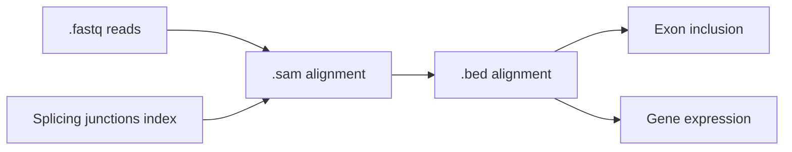
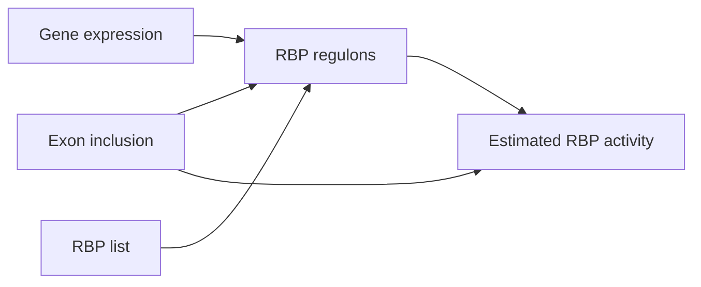

# Reverse engineering splicing-regulatory networks from diverse cellular transcriptomes

## Summary
This pipeline is composed of two workflows that can be run independently depending on your starting materials:
- The “Mapping and quantification” workflow takes single- or paired-end fastq files as input and applies the OLego pipeline (Wu et al. 2013), returning RPKM (reads per kilobase million) gene expression and PSI (percent spliced in) exon inclusion matrices. This workflow can be applied keeping the data as single cells/samples or pooling cells into pseudobulk samples based on a configuration file.
- The “Network reverse engineering” workflow takes an RPKM gene expression matrix, a PSI exon inclusion matrix, and a list of RBP names as input, inferring splicing regulatory networks and estimating RBP activity per single cell or per sample. Missing data values are first imputed by k-nearest neighbor. Then, it applies the ARACNe algorithm (Algorithm for the Reconstruction of Accurate Cellular NEtworks; Margolin et al. 2006), inferring splicing regulatory networks based on the mutual information between RBP expression and exon inclusion and returning a list of network edges (i.e. RBP regulons) with corresponding mutual information and p-values. Finally, it applies the VIPER algorithm (Virtual Inference of Protein activity by Enriched Regulon analysis; Alvarez et al. 2016) to estimate RBP activity for each input sample. In this step, the aREA algorithm (analytic Rank-based Enrichment Analysis) assesses the enrichment of regulon exons for each RBP based on weighted sums of quantile-transformed regulon exon inclusion ranks (see source literature for details). This workflow returns the splicing regulatory network and a matrix of estimated RBP activity values (normalized enrichment scores).

### Mapping and quantification
> **Note** 
Ignore this workflow and its requirements if you already have quantified gene expression and exon inclusion as tab-separated matrices and do not wish to use our tools for quantification.

If your staring materials are single-end or paired-end `.fastq` reads, run the `mapping_and_quantification` workflow to quantify splicing and gene expression for each single cell or sample and combine mapped reads across sample groups (or cell types, in our specific case).


#### Requirements
Tested with versions in brackets:
- `Python` (3.8.17)
    - `pandas` (1.3.0)
- `R` (4.1.0)
    - `optparse` (1.7.1)
    - `tidyverse` (1.3.1)
    - `impute` (1.66.0)
- `snakemake` (7.28.3)
- `Perl` (5.32.1)
- [`olego`](https://github.com/chaolinzhanglab/olego) (1.1.9) *
- [`quantas`](https://github.com/chaolinzhanglab/quantas) (1.1.1) *
- [`czplib`](https://github.com/chaolinzhanglab/czplib) (1.0.9) *
- [forked `ARACNe-AP`](https://github.com/chaolinzhanglab/ARACNe-AP)

(*) see [recommended installations below](#recommended-installations)

#### Usage
0. **Test installation locally**
    Runs the full workflow using small .fastq files in `data/examples/fastq/paired_end` and checks the final gene expression and splicing matrices obtained are reproducible in your setting. To minimize the size of this repository we have uploaded fastq example files on figshare.
    - paired-end sample data: https://figshare.com/s/c0de1df7a0f8dadfc116
    - single-end sample data: https://figshare.com/s/fb696f3d6832bee81c91
    
    - Make sure to set the paths of the downloaded files correctly in the testing/mapping_and_quantification-config.yaml file.
    - Set `TEST_MODE: True` in the configuration file.
    - Make sure the following paths in `testing/mapping_and_quantification-config.yaml` related to Olego and Quantas installation are correct (see [Recommended installations](#recommended-installations) below):
        - `OLEGO_SRC_DIR`
        - `OLEGO_INDEX_PATT`
        - `OLEGO_JUNCTIONS_FILE`
        - `QUANTAS_SRC_DIR`
        - `QUANTAS_ANNOTATION_DIR`

    Run the test:
    ```shell
    # paired-end workflow
    snakemake -s mapping_and_quantification-workflow.smk --configfile=testing/mapping_and_quantification-config_paired_end.yaml
    # single-end workflow
    snakemake -s mapping_and_quantification-workflow.smk --configfile=testing/mapping_and_quantification-config_single_end.yaml
    ```
2. **Customization**: 
    - Prepare your own `mapping_and_quantification-sample_info.csv` table with your own fastq paths, sample identifiers and grouping labels.
    - Modify `mapping_and_quantification-config.yaml` accordingly, especially, in the paths section (see "edit" tags)

3. **Run workflow**
    - locally
        ```shell
        snakemake -s mapping_and_quantification-workflow.smk --cores 12
        ```
    - on computing cluster (leave it running in a screen session in the login node)
        ```shell
        snakemake -s mapping_and_quantification-workflow.smk \
                  --cluster "qsub -cwd -pe smp {threads} -l mem={resources.memory}G,time={resources.runtime}" \
                  --jobs 100
        ```

### Network reverse engineering
Obtains RBP-splicing event regulons with ARACNe using a gene expression matrix, a splicing quantification matrix and a list of genes of interest (RBP). Applies the VIPER algorithm to the inferred regulons and exon inclusion matrices to estimate RBP activity.
> **Note** 
While this workflow infers regulatory networks with ARACNe and uses them for RBP activity estimation by default, VIPER can also be run using regulatory networks derived using other methods. For details of how to run this step using networks produced elsewhere see the alternative workflow at `https://github.com/MiqG/viper_splicing`, which uses the empirically derived networks as described in Anglada-Girotto et al. 2024.



#### Requirements
Tested with versions in brackets:
- `Python` (3.8.17)
    - `pandas` (1.3.0)
- `R` (4.1.0)
    - `optparse` (1.7.1)
    - `tidyverse` (1.3.1)
    - `viper` (1.26.0)
- `snakemake` (7.28.3)
- `Perl` (5.32.1)

#### Usage
0. **Test installation locally**
    Runs the full workflow using the input files supplied with the original ARACNe distribution, available at `data/examples/network_reverse_engineering/ARACNe_repo`. The configuration is set to access these files by default.
    ```shell
    snakemake -s network_reverse_engineering-workflow.smk --configfile=testing/network_reverse_engineering-config.yaml
    ```
    We also include for reference the cell type-level exon inclusion matrix, RBP expression matrix, and inferred regulatory network files used in our publication (Moakley et al. 2024), available at `data/examples/network_reverse_engineering/msCorticalCellTypes`. The inferred network files can be used to estimate RBP activity by users with exon inclusion and RBP expression data quantified in mouse cortical cells. 

1. **Customization**: modify `network_reverse_engineering-config.yaml` accordingly, especially, in the paths section (see "edit" tags)
> **Warning**
Make sure the gene identifiers in your gene list are found in the first column of the gene expression matrix.

2. **Run workflow**
    - locally
        ```shell
        snakemake -s network_reverse_engineering-workflow.smk --cores 12
        ```
    - on computing cluster (leave it running in a screen session in the login node)
        ```shell
        snakemake -s network_reverse_engineering-workflow.smk \
                  --cluster "qsub -cwd -pe smp {threads} -l mem={resources.memory}G,time={resources.runtime}" \
                  --jobs 100
        ```
## Recommended installations
Examples with mm10 genome.
- **olego** ([documentation](https://zhanglab.c2b2.columbia.edu/index.php/OLego_Documentation))
    - software
        ```shell
        git clone https://github.com/chaolinzhanglab/olego src
        cd src/olego
        make
        ```
    - download genome fasta sequence
        ```shell
        mkdir -p data/gencode/genomes/
        wget https://ftp.ebi.ac.uk/pub/databases/gencode/Gencode_mouse/release_M10/GRCm38.p4.genome.fa.gz -O 
        gunzip data/gencode/genomes/GRCm38.p4.genome.fa.gz
        ```
    - build index
        ```shell
        mkdir -p data/olego/indices/mm10/
        src/olego/olegoindex -a bwtsw -p data/olego/indices/mm10/index data/gencode/genomes/GRCm38.p4.genome.fa
        ```
    - download junction database(s) of interest
        ```shell
        mkdir -p data/olego/junctions/
        wget http://zhanglab.c2b2.columbia.edu/data/OLego/mm10.intron.hmr.bed.gz -O olego/junctions/mm10.intron.hmr.bed.gz
        gunzip data/olego/junctions/mm10.intron.hmr.bed.gz
        ```
        
- **quantas** ([documentation](https://zhanglab.c2b2.columbia.edu/index.php/Quantas_Documentation))
    - software
        ```shell
        # quantas itself
        git clone https://github.com/chaolinzhanglab/quantas src

        # dependency
        git clone https://github.com/chaolinzhanglab/czplib src
        export PERL5LIB=/your/path/to/the/repository/src/czplib # recommended to place in .bashrc or .bash_profile
        conda install -c bioconda perl-math-cdf
        ```
    - download annotations
        ```shell
        mkdir -p data/quantas/annotations/
        wget http://zhanglab.c2b2.columbia.edu/data/Quantas/data/mm10.tgz -O data/quantas/annotations/
        tar -xvf mm10.tgz -C data/quantas/annotations/
        ```
        
- **ARACNe-AP**
    - software
        ```shell
        git clone https://github.com/chaolinzhanglab/ARACNe-AP src
        cd src/ARACNe-AP
        ant main
        ```
> **Note**
If you already installed everything in a different folder and you wish not to modify config files, we recommend you create a symbolic link to the folders and files generated above, which should seamlessly allow you to run the pipeline workflows.

## Contact
Please, report any issues that you experience through this repository's ["Issues"]().

## License
`mras` is distributed under an Apache License 2.0 (see [LICENSE]()).


## Citation
Daniel F Moakley, Melissa Campbell, Miquel Anglada-Girotto, Huijuan Feng, Andrea Califano, Edmund Au, Chaolin Zhang. 2024. Reverse engineering neuron type-specific and type-orthogonal splicing-regulatory networks using single-cell transcriptomes. bioRxiv, doi: https://doi.org/10.1101/2024.06.13.597128

## References
Wu, J., et al. (2013). "OLego: Fast and sensitive mapping of spliced mRNA-Seq reads using small seeds." Nucleic Acids Res 41(10): 5149-5163.
Margolin, A. A., et al. (2006). "ARACNE: an algorithm for the reconstruction of gene regulatory networks in a mammalian cellular context." BMC Bioinformatics 7 Suppl 1(Suppl 1): S7.
Alvarez, M. J., et al. (2016). "Functional characterization of somatic mutations in cancer using network-based inference of protein activity." Nat Genet 48(8): 838-847.
Anglada-Girotto, M., Moakley, D. F., Zhang, C., Miravet-Verde, S., Califano, A., & Serrano, L. (2024). Disentangling the splicing factor programs underlying complex molecular phenotypes. bioRxiv, 2024-06.	
	

	

