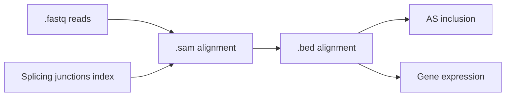
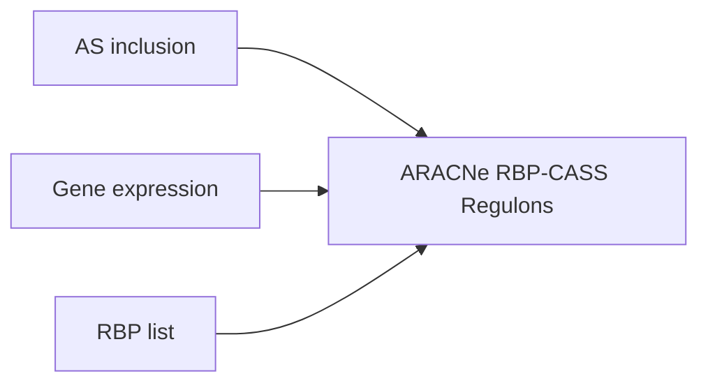

# Reverse engineering neuron type-specific splicing-regulatory networks from single-cell transcriptomes


## Outline
This pipeline is composed of two workflows that can be run independently depending on your starting materials. 

### Mapping and quantification
> **Note** 
Ignore this workflow and its requirements if you already have quantified gene expression and alternative splicing as tab-separated matrices and do not wish to use our tools for quantification.

If your staring material are single-end or paired-end `.fastq` reads, run the `mapping_and_quantification` workflow to quantify alternative splicing and gene expression for each single cell or sample and combine mapped reads across sample groups (or cell types, in our specific case).



#### Requirements
Tested with versions in brackets:
- `Python` (3.8.17)
    - `pandas` (1.3.0)
- `R` (4.1.0)
    - `optparse` (1.7.1)
    - `tidyverse` (1.3.1)
    - `impute` (1.66.0)
- `snakemake` (7.28.3)
- `Perl` (5.32.1)
- [`olego`](https://github.com/chaolinzhanglab/olego) (1.1.9) *
- [`quantas`](https://github.com/chaolinzhanglab/quantas) (1.1.1) *
- [`czplib`](https://github.com/chaolinzhanglab/czplib) (1.0.9) *
- [forked `ARACNe-AP`](https://github.com/chaolinzhanglab/ARACNe-AP)

(*) see [recommended installations below](#recommended-installations)


#### Usage
0. **Test installation locally**
    Runs the full workflow using small .fastq files in `data/examples/fastq/paired_end` and checks the final gene expression and splicing matrices obtained are reproducible in your setting. To minimize the size of this repository we have uploaded fastq example files on figshare:

    - paired-end sample data: https://figshare.com/s/c0de1df7a0f8dadfc116
    - (optional) single-end sample data: https://figshare.com/s/fb696f3d6832bee81c91
   
   Make sure to download them and place them under the corresponding path previously mentioned.
    
    1. Make sure the following paths in `testing/mapping_and_quantification-config.yaml` related to Olego and Quantas installation are correct (see [Recommended installations](#recommended-installations) below):
        - `OLEGO_SRC_DIR`
        - `OLEGO_INDEX_PATT`
        - `OLEGO_JUNCTIONS_FILE`
        - `QUANTAS_SRC_DIR`
        - `QUANTAS_ANNOTATION_DIR`
    2. Test installation:
    ```shell
    # paired end workflow
    snakemake -s mapping_and_quantification-workflow.smk --configfile=testing/mapping_and_quantification-config_paired_end.yaml
    # single end workflow
    snakemake -s mapping_and_quantification-workflow.smk --configfile=testing/mapping_and_quantification-config_single_end.yaml
    ```


2. **Customization**: 
    - Prepare your own `mapping_and_quantification-sample_info.csv` table with your own fastq paths, sample identifiers and grouping labels.
    - Modify `mapping_and_quantification-config.yaml` accordingly, especially, in the paths section (see "edit" tags)


3. **Run workflow**
    - locally
        ```shell
        snakemake -s mapping_and_quantification-workflow.smk --cores 12
        ```
    - on computing cluster (leave it running in a screen session in the login node)
        ```shell
        snakemake -s mapping_and_quantification-workflow.smk \
                  --cluster "qsub -cwd -pe smp {threads} -l mem={resources.memory}G,time={resources.runtime}" \
                  --jobs 100
        ```


### Network reverse engineering
Obtains RBP-splicing event regulons with ARACNe using a gene expression matrix, a splicing quantification matrix and a list of genes of interest (RBP).



#### Requirements
Tested with versions in brackets:
- `Python` (3.8.17)
    - `pandas` (1.3.0)
- `R` (4.1.0)
    - `optparse` (1.7.1)
    - `tidyverse` (1.3.1)
    - `viper` (1.26.0)
- `snakemake` (7.28.3)
- `Perl` (5.32.1)


#### Usage
0. **Test installation locally**
    Runs the full workflow using tab-separated files generated during development `data/examples/testing/paired_end/` and checks the final gene expression and splicing matrices obtained are reproducible in your setting. Here, there is no need to edit the config file.
    ```shell
    snakemake -s network_reverse_engineering-workflow.smk --configfile=testing/network_reverse_engineering-config.yaml
    ```


1. **Customization**: modify `network_reverse_engineering-config.yaml` accordingly, especially, in the paths section (see "edit" tags)
> **Warning**
Make sure the gene identifiers in your gene list are found in the first column of the gene expression matrix.


2. **Run workflow**
    - locally
        ```shell
        snakemake -s network_reverse_engineering-workflow.smk --cores 12
        ```
    - on computing cluster (leave it running in a screen session in the login node)
        ```shell
        snakemake -s network_reverse_engineering-workflow.smk \
                  --cluster "qsub -cwd -pe smp {threads} -l mem={resources.memory}G,time={resources.runtime}" \
                  --jobs 100
        ```

## Recommended installations
Examples with mm10 genome.
- **olego** ([documentation](https://zhanglab.c2b2.columbia.edu/index.php/OLego_Documentation))
    - software
        ```shell
        git clone https://github.com/chaolinzhanglab/olego src
        cd src/olego
        make
        ```
    - download genome fasta sequence
        ```shell
        mkdir -p data/gencode/genomes/
        wget https://ftp.ebi.ac.uk/pub/databases/gencode/Gencode_mouse/release_M10/GRCm38.p4.genome.fa.gz -O 
        gunzip data/gencode/genomes/GRCm38.p4.genome.fa.gz
        ```
    - build index
        ```shell
        mkdir -p data/olego/indices/mm10/
        src/olego/olegoindex -a bwtsw -p data/olego/indices/mm10/index data/gencode/genomes/GRCm38.p4.genome.fa
        ```
    - download junction database(s) of interest
        ```shell
        mkdir -p data/olego/junctions/
        wget http://zhanglab.c2b2.columbia.edu/data/OLego/mm10.intron.hmr.bed.gz -O olego/junctions/mm10.intron.hmr.bed.gz
        gunzip data/olego/junctions/mm10.intron.hmr.bed.gz
        ```
        
- **quantas** ([documentation](https://zhanglab.c2b2.columbia.edu/index.php/Quantas_Documentation))
    - software
        ```shell
        # quantas itself
        git clone https://github.com/chaolinzhanglab/quantas src

        # dependency
        git clone https://github.com/chaolinzhanglab/czplib src
        export PERL5LIB=/your/path/to/the/repository/src/czplib # recommended to place in .bashrc or .bash_profile
        conda install -c bioconda perl-math-cdf
        ```
    - download annotations
        ```shell
        mkdir -p data/quantas/annotations/
        wget http://zhanglab.c2b2.columbia.edu/data/Quantas/data/mm10.tgz -O data/quantas/annotations/
        tar -xvf mm10.tgz -C data/quantas/annotations/
        ```
        
- **ARACNe-AP**
    - software
        ```shell
        git clone https://github.com/chaolinzhanglab/ARACNe-AP src
        cd src/ARACNe-AP
        ant main
        ```
    
    
> **Note**
If you already installed everything in a different folder and you wish not to modify config files, we recommend you create a symbolic link to the folders and files generated above, which should seamlessly allow you to run the pipeline workflows.


## Contact
Please, report any issues that you experience through this repository's ["Issues"]().


## License
`mras` is distributed under an Apache License 2.0 (see [LICENSE]()).


## Citation
Daniel F Moakley, Melissa Campbell, Miquel Anglada-Girotto, Huijuan Feng, Andrea Califano, Edmund Au, Chaolin Zhang. 2024. Reverse engineering neuron type-specific and type-orthogonal splicing-regulatory networks using single-cell transcriptomes. bioRxiv, doi: https://doi.org/10.1101/2024.06.13.597128
